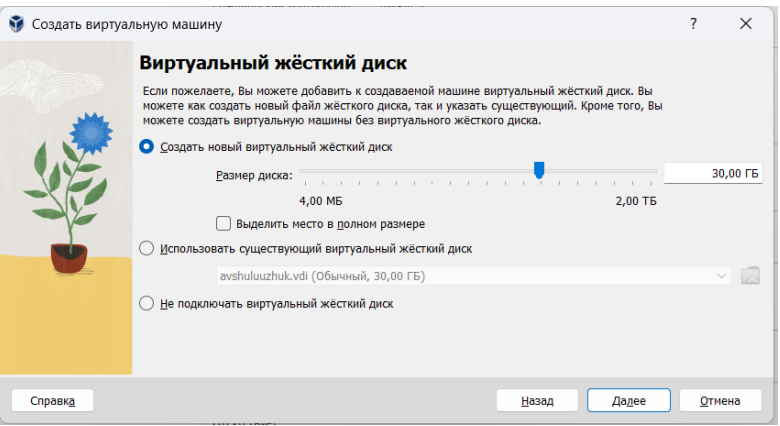

---
## Front matter
title: "Лабораторная работа № 1"
subtitle: "Установка и конфигурация операционной системы на виртуальную машину"
author: "Шулуужук Айраана Вячеславовна"

## Generic otions
lang: ru-RU
toc-title: "Содержание"

## Bibliography
bibliography: bib/cite.bib
csl: pandoc/csl/gost-r-7-0-5-2008-numeric.csl

## Pdf output format
toc: true # Table of contents
toc-depth: 2
lof: true # List of figures
lot: true # List of tables
fontsize: 12pt
linestretch: 1.5
papersize: a4
documentclass: scrreprt
## I18n polyglossia
polyglossia-lang:
  name: russian
  options:
	- spelling=modern
	- babelshorthands=true
polyglossia-otherlangs:
  name: english
## I18n babel
babel-lang: russian
babel-otherlangs: english
## Fonts
mainfont: PT Serif
romanfont: PT Serif
sansfont: PT Sans
monofont: PT Mono
mainfontoptions: Ligatures=TeX
romanfontoptions: Ligatures=TeX
sansfontoptions: Ligatures=TeX,Scale=MatchLowercase
monofontoptions: Scale=MatchLowercase,Scale=0.9
## Biblatex
biblatex: true
biblio-style: "gost-numeric"
biblatexoptions:
  - parentracker=true
  - backend=biber
  - hyperref=auto
  - language=auto
  - autolang=other*
  - citestyle=gost-numeric
## Pandoc-crossref LaTeX customization
figureTitle: "Рис."
tableTitle: "Таблица"
listingTitle: "Листинг"
lofTitle: "Список иллюстраций"
lotTitle: "Список таблиц"
lolTitle: "Листинги"
## Misc options
indent: true
header-includes:
  - \usepackage{indentfirst}
  - \usepackage{float} # keep figures where there are in the text
  - \floatplacement{figure}{H} # keep figures where there are in the text
---

# Цель работы

Целью данной работы является приобретение практических навыков установки операционной системы на виртуальную машину, настройки минимально необходимых для дальнейшей работы сервисов.

# Задание

1. Создать новую виртуальную машину

2. Установить на виртуальную машину VirtualBox операционную систему
Linux (дистрибутив Rocky)

3. Установка первоначальных настроек виртуальной машины

4. Запуск виртуальной машины и образа диска домашней гостевой ОС

5. Выполнение домашнего задания

# Выполнение лабораторной работы

## Создание виртуальной машины

Создаем виртуальную машину  (рис. @fig:001): 

{#fig:001 width=70%}

Указываем размер основной памяти виртуальной машины – 4096 МБ и число процессоров - 2 (рис. @fig:002)

{#fig:002 width=70%}

Задаем размер виртуального жесткого диска – 30 ГБ (рис. @fig:003)

{#fig:003 width=70%}

Создали виртуальную машину и запускаем образ ОС (рис. @fig:004)

{#fig:004 width=70%}

## Запуск виртуальной машины и образа диска домашней гостевой ОС

В качестве языка интерфейса выбираем английский язык (рис. @fig:005)

{#fig:005 width=70%}

Включим сетевое соединение и в качестве имени узла укажем user.localdomain, где вместо user указываем имя пользователя(рис. @fig:006)

{#fig:006 width=70%}

Установим пароль для root, задаем локального пользователя с правами
администратора и пароль для него (рис. @fig:007)

{#fig:007 width=70%}

Начинаем установку ОС. Перезагружаем виртуальную машину.
Подключаем образ диска дополнений гостевой ОС (рис. @fig:08)

{#fig:008 width=70%}

## Домашнее задание

В терминале выполняем команду dmesg и используем его для поиска
dmegs | less (рис. @fig:009) (рис. @fig:010)

{#fig:009 width=70%}

{#fig:010 width=70%}

Узнаем версию ядра Linux. Команда dmesg | grep -i “linux
version” (рис. @fig:011) 

{#fig:011 width=70%}

Частота процессора. Команда dmesg | grep -i “MHz (рис. @fig:012) 

{#fig:012 width=70%}

Модель процессора. Команда dmesg | grep -i “CPU0” (рис. @fig:013)

{#fig:013 width=70%}

Объем доступной оперативной памяти – 3,8 ГБ. Команда dmesg
| grep -i “memory” (рис. @fig:014)

{#fig:014 width=70%}

Тип обнаруженного гипервизора - KVM. Команда dmesg | grep
-i “hypervisor detected” (рис. @fig:015)

{#fig:015 width=70%}

Тип файловой системы корневого раздела – xfs. Используем
команду df -Th (рис. @fig:016)

{#fig:016 width=70%}

Последовательность монтирования файловых систем.
Для этого используем команду dmesg | grep -i “mount” (рис. @fig:016)

{#fig:016 width=70%}

# Ответы на контрольные вопросы 

1. Какую информацию содержит учётная запись пользователя?

Учётная запись, как правило, содержит сведения, необходимые для
опознания пользователя при подключении к системе, сведения
для авторизации и учета. Это идентификатор пользователя (login) и его
пароль. Пароль или его аналог, как правило, хранится
в зашифрованном или хешированном виде для обеспечения
его безопасности

2. Укажите команды терминала:

– для получения справки по команде – команда help
– для перемещения по файловой системе – команда cd
– для просмотра содержимого каталога – команда ls
– для создания каталога – команда mkdir
- для удаления каталогов – команда rmdir
– для создания файлов – команда touch
- для удаления файлов – команда rm
– для задания определённых прав на файл / каталог – команда chmod
– для просмотра истории команд – команда history

3. Что такое файловая система?

Файловая система Linux обычно представляет собой встроенный уровень
операционной системы Linux, используемый для управления данными
хранилища. Он контролирует, как данные хранятся и извлекаются. Он
управляет именем файла, размером файла, датой создания и другой
информацией о файле.

4. Как посмотреть, какие файловые системы смонтированы в ОС?

Команда findmnt — это простая утилита командной строки, используемая
для отображения списка смонтированных файловых систем или поиска
файловой системы в /etc/fstab, /etc/mtab и /proc/self/mountinfo

5. Как удалить зависший процесс?

Использование команды xkill в терминале. Это инструмент
принудительного уничтожения процесса, который предустановлен в
Ubuntu, но его можно также установить через терминал в других
дистрибутивах. Команда kill может быть использована только с
указанием идентификатора процесса.

# Выводы

В ходе выполнения лабораторной работы были приобретены практические
навыки установки операционной системы на виртуальную машину и
настройка минимально необходимых для дальнейшей работы сервисов. Было
выполнено дополнительное задание, где в процессе мы узнавали требуемую
информацию
