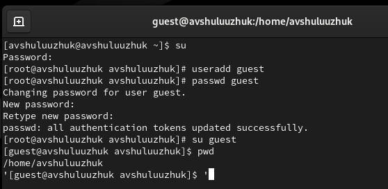
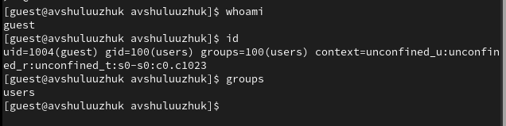
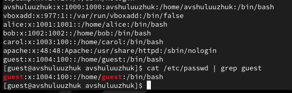
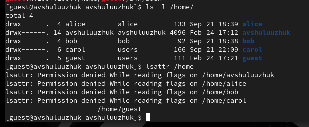
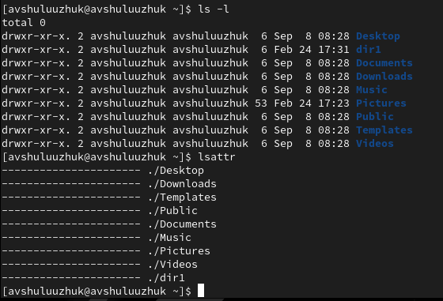
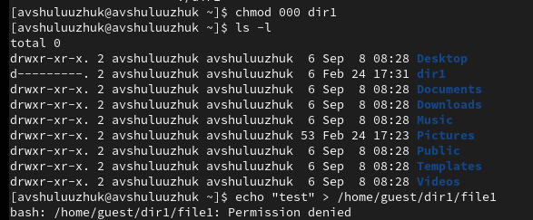

---
## Front matter
lang: ru-RU
title: Лабораторная работа № 2
subtitle: Дискреционное разграничение прав в Linux. Основные атрибуты
author:
  - Шулуужук А. В.
institute:
  - Российский университет дружбы народов, Москва, Россия
date: 16 февраль 2024

## i18n babel
babel-lang: russian
babel-otherlangs: english

## Formatting pdf
toc: false
toc-title: Содержание
slide_level: 2
aspectratio: 169
section-titles: true
theme: metropolis
header-includes:
 - \metroset{progressbar=frametitle,sectionpage=progressbar,numbering=fraction}
 - '\makeatletter'
 - '\beamer@ignorenonframefalse'
 - '\makeatother'
---

## Цели и задачи

Получение практических навыков работы в консоли с атрибутами файлов, закрепление теоретических основ дискреционного разграничения доступа в современных системах с открытым кодом на базе ОС Linux1.

# Выполнение лабораторной работы

##

В установленной при выполнении предыдущей лабораторной работы операционной системе создадим учётную запись пользователя guest: useradd guest. Зададим пароль учетной записи.

{#fig:001 width=70%}

##

Уточним имя пользователя командой whoami. Уточним имя пользователя, его группу, а также группы, куда входит пользователь, командой id. Сравните вывод id с выводом команды groups

{#fig:002 width=100%}

##

Просмотрим файл /etc/passwd командой cat /etc/passwd. Найдем в нём свою учётную запись. Определим uid пользователя.
Определим gid пользователя

{#fig:003 width=70%}

##

Определим существующие в системе директории командой ls -l /home/. Проверим, какие расширенные атрибуты установлены на поддиректориях, находящихся в директории /home, командой: lsattr /home

{#fig:004 width=60%}

##

Создадим в домашней директории поддиректорию dir1 командой mkdir dir1. Определим командами ls -l и lsattr, какие права доступа и расширенные атрибуты были выставлены на директорию dir1.

{#fig:005 width=60%}

##

Снимаем с директории dir1 все атрибуты командой chmod 000 dir1 и проверим с её помощью правильность выполнения команды ls -l. Попытаемся создать в директории dir1 файл file1 командой echo "test" > /home/guest/dir1/file1
В итоге мы получим отказ в выполнении действия, так как нет прав доступа

{#fig:006 width=60%}

## Выводы

В ходе выполнения лабораторной работы были приобретены практические
навыки работы в консоли с атрибутами файлов, закрепление теоретических основ дискреционного разграничения доступа в современных системах с открытым кодом на базе ОС Linux1.
