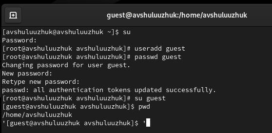
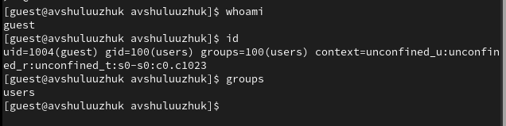
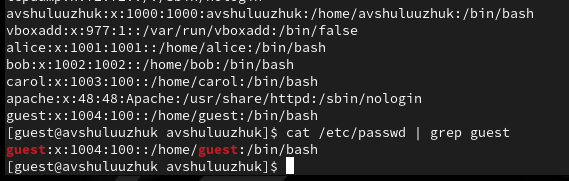
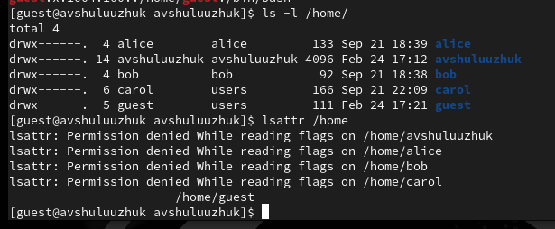
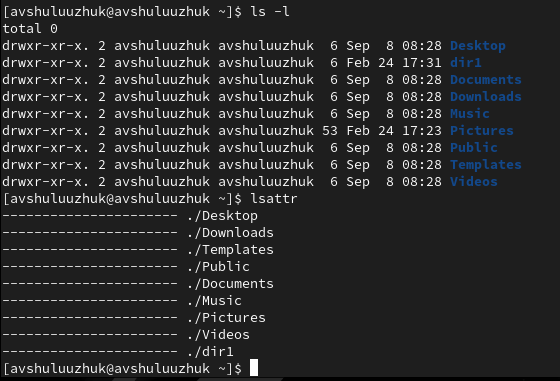
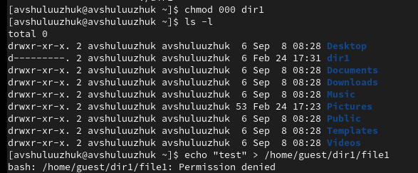

---
## Front matter
title: "Лабораторная работа № 2"
subtitle: "Дискреционное разграничение прав в Linux. Основные атрибуты"
author: "Шулуужук Айраана Вячеславовна"

## Generic otions
lang: ru-RU
toc-title: "Содержание"

## Bibliography
bibliography: bib/cite.bib
csl: pandoc/csl/gost-r-7-0-5-2008-numeric.csl

## Pdf output format
toc: true # Table of contents
toc-depth: 2
lof: true # List of figures
lot: true # List of tables
fontsize: 12pt
linestretch: 1.5
papersize: a4
documentclass: scrreprt
## I18n polyglossia
polyglossia-lang:
  name: russian
  options:
	- spelling=modern
	- babelshorthands=true
polyglossia-otherlangs:
  name: english
## I18n babel
babel-lang: russian
babel-otherlangs: english
## Fonts
mainfont: PT Serif
romanfont: PT Serif
sansfont: PT Sans
monofont: PT Mono
mainfontoptions: Ligatures=TeX
romanfontoptions: Ligatures=TeX
sansfontoptions: Ligatures=TeX,Scale=MatchLowercase
monofontoptions: Scale=MatchLowercase,Scale=0.9
## Biblatex
biblatex: true
biblio-style: "gost-numeric"
biblatexoptions:
  - parentracker=true
  - backend=biber
  - hyperref=auto
  - language=auto
  - autolang=other*
  - citestyle=gost-numeric
## Pandoc-crossref LaTeX customization
figureTitle: "Рис."
tableTitle: "Таблица"
listingTitle: "Листинг"
lofTitle: "Список иллюстраций"
lotTitle: "Список таблиц"
lolTitle: "Листинги"
## Misc options
indent: true
header-includes:
  - \usepackage{indentfirst}
  - \usepackage{float} # keep figures where there are in the text
  - \floatplacement{figure}{H} # keep figures where there are in the text
---

# Цель работы

Получение практических навыков работы в консоли с атрибутами файлов, закрепление теоретических основ дискреционного разграничения доступа в современных системах с открытым кодом на базе ОС Linux1.

# Выполнение лабораторной работы

В установленной при выполнении предыдущей лабораторной работы операционной системе создадим учётную запись пользователя guest (использую учётную запись администратора): useradd guest.

Зададим пароль для пользователя guest (использую учётную запись администратора): passwd guest. И войдем в систему от имени созданного пользователя.

Определим директорию, в которой находимся, командой pwd. (рис. @fig:001)

{#fig:001 width=100%}

Уточним имя пользователя командой whoami. Уточним имя пользователя, его группу, а также группы, куда входит пользователь, командой id. Сравните вывод id с выводом команды groups (рис. @fig:002)

{#fig:002 width=100%}

Просмотрим файл /etc/passwd командой cat /etc/passwd. Найдем в нём свою учётную запись. Определим uid пользователя.
Определим gid пользователя (рис. @fig:003)

{#fig:003 width=100%}

Определим существующие в системе директории командой ls -l /home/. Проверим, какие расширенные атрибуты установлены на поддиректориях, находящихся в директории /home, командой: lsattr /home(рис. @fig:004)

{#fig:004 width=100%}

Создадим в домашней директории поддиректорию dir1 командой mkdir dir1. Определим командами ls -l и lsattr, какие права доступа и расширенные атрибуты были выставлены на директорию dir1. (рис. @fig:005)

{#fig:005 width=100%}

Снимаем с директории dir1 все атрибуты командой chmod 000 dir1 и проверим с её помощью правильность выполнения команды ls -l. Попытаемся создать в директории dir1 файл file1 командой echo "test" > /home/guest/dir1/file1
В итоге мы получим отказ в выполнении действия, так как нет прав доступа (рис. @fig:006)

{#fig:006 width=100%}

# Выводы

В ходе выполнения лабораторной работы были приобретены практические
навыки работы в консоли с атрибутами файлов, закрепление теоретических основ дискреционного разграничения доступа в современных системах с открытым кодом на базе ОС Linux1.
