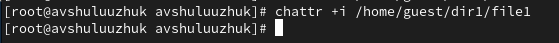

---
## Front matter
lang: ru-RU
title: Лабораторная работа № 4
subtitle: Основы интерфейса взаимодействия пользователя с системой Unix на уровне командной строки
author:
  - Шулуужук Айраана Вячеславовна НПИбд-02-22
institute:
  - Российский университет дружбы народов, Москва, Россия
 
date: 27 февраля 2023 

## i18n babel
babel-lang: russian
babel-otherlangs: english

## Formatting pdf
toc: false
toc-title: Содержание
slide_level: 2
aspectratio: 169
section-titles: true
theme: metropolis
header-includes:
 - \metroset{progressbar=frametitle,sectionpage=progressbar,numbering=fraction}
 - '\makeatletter'
 - '\beamer@ignorenonframefalse'
 - '\makeatother'
---

## Докладчик

:::::::::::::: {.columns align=center}
::: {.column width="70%"}

  * Шулуужук Айраана Вячеславовна 
  * НПИбд-02-22
  * 1132221890
  * Российский университет дружбы народов

:::
::: {.column width="30%"}

:::
::::::::::::::
# Цели и задачи

Приобретение практических навыков взаимодействия пользователя с системой посредством командной строки

# Выполнение лабораторной работы

## Команда pwd

Определим полное имя домашнего каталога. Используем команду pwd

{width=70%}

## Команда ls 

Перейдем в каталог /tmp. Выводим на экран сожержимое каталога tmp, используя команду ls с различными опциями.

{#fig:003 width=50%}

## Команда ls 

{#fig:004 width=70%}

## Команда ls 

{#fig:005 width=70%}

## Команда ls 

Определим, есть ли в каталоге /var/spool подкаталог с именем cron. В результате мы находим, что нет файла с именем cron 

{width=70%}

## Команда ls 

Выводим на экран его содержимое и определяем кто является владельцем файлов и каталогов

{width=70%}

## Команда mkdir 

{width=70%}

{width=70%}

## Команда mkdir 

{#fig:010 width=70%}

## Команда rmdir 

Затем удаляем эти каталоги одной командой rmdir letters memos misk и проверим удалились ли они

{width=70%}

## Команда rm

Удаляем каталог /newdir/morefun командой rm с опцией -r. Проверяем удаление каталога

{width=70%}

## Команда man ls

С помощью команды man ls определяем, что для просмотра содержимого каталога и подкаталогов, входящих в него, нужно использовать опцию -R 

{width=70%}

## Команда man ls

С помощью команды man ls опредеяем набор опций команды, позволяющий отсортировать по времени последнего изменения  список содержимого каталога. Это опции: -с -lt 

{width=70%}

## Команда man cd 

Команда cd испоьзуется для перемещения по файловой системе

{width=70%}

## Команда man pwd

Для определения абсолютного пути к текущему каталогу используется команда pwd

{width=70%}

## Команда man mkdir

Команда mkdir используется для создания каталогов

{width=50%}

## Команда man rmdir 

Команда rmdir используется для удаления пустых каталогов

{width=70%}

## Команда man rm 

Команда rm используется для удаления файлов и каталогов

{width=50%}

## Команда history

Используя информацию, полученную при помощи команды history, выполняем модификацию команд mcdir, rmdir

{width=70%}

# Выводы

В ходе выполнения лабораторной работы были приобретены практические навыки взаимодействия пользователя с системой посредством командной строки. Был составлен отчет о выполнении лаборатороной работы

