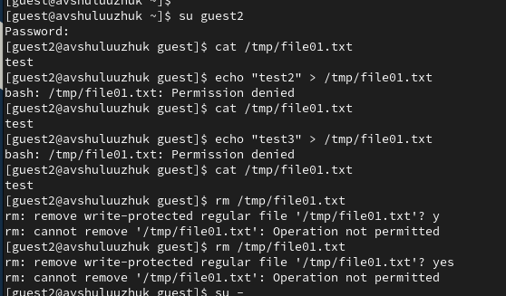

---
## Front matter
lang: ru-RU
title: Лабораторная работа № 5
subtitle: Анализ файловой системы Linux. Команды для работы с файлами и каталогами
author:
  - Шулуужук Айраана Вячеславовна НПИбд-02-22
institute:
  - Российский университет дружбы народов, Москва, Россия
 
date: 06 матра 2023 

## i18n babel
babel-lang: russian
babel-otherlangs: english

## Formatting pdf
toc: false
toc-title: Содержание
slide_level: 2
aspectratio: 169
section-titles: true
theme: metropolis
header-includes:
 - \metroset{progressbar=frametitle,sectionpage=progressbar,numbering=fraction}
 - '\makeatletter'
 - '\beamer@ignorenonframefalse'
 - '\makeatother'
---

## Докладчик

:::::::::::::: {.columns align=center}
::: {.column width="70%"}

  * Шулуужук Айраана Вячеславовна 
  * НПИбд-02-22
  * 1132221890
  * Российский университет дружбы народов

:::
::: {.column width="30%"}

:::
::::::::::::::
# Цели и задачи

Ознакомление с файловой системой Linux, её структурой, именами и содержанием каталогов. Приобретение практических навыков по применению команд для работы с файлами и каталогами, по управлению процессами (и работами), по проверке использования диска и обслуживанию файловой системы.

# Выполнение лабораторной работы

## Команда cp

Копируем файл /usr/include/sys/io.h в домашний каталог и назовем его equipment, используя команду cp

{width=70%}

## Команда mv

Создаем каталог ski.plases и переместим в созданную директорию файл equipment (команда mv) 

{width=70%}

## Команда touch

Создаем файл abc1 (команда touch) и копируем его в каталог ski.plases, назовем equiplist2

{width=70%}

## Команда chmod

Создадим файлы my_os, feathers и каталоги australia, play. Присвоим им следующие права, используя команду chmod

{width=60%}

{width=50%}

## Команда cat 

Просмотрим содержимое файла /etc/passwd 

{width=70%}

## Команда mv 

Переместим файл file.old в каталог play

{width=70%}

## Команда chmod 

Лишим владельца файла feathers права на чтение, попробуем просмотреть и скопировать этот файл. В результате без прав на чтение владелец файла не сможет просмотреть и скопировать его

{width=70%}

## Команда chmod

Лишим владельцу каталога play права на выполнение и попробуем перейти в него. Без прав на выполнение владелец не сможет перейти в него. Далее восстановим владельцу права на выполнение

{width=70%}

## Команда man mount 

Команда mount используется для просмотра используемых в операционной системе файловых систем 

{width=70%}

## Команда man fsck

Команда fsck нужна для проверки и восстановления целостности файловой системы.

{width=70%}

## Команда man mkfs 

Команда mkfs используется для создания файловой системы Linux на устройстве, обычно в разделе жесткого диска.

{width=70%}

# Выводы

В ходе выполения лабораторной работы мы ознакомились с файловой системой Linux, ее структурой, именами и содержанием каталогов. Приобрели практические навыки по применению команд для работы с файлами и каталогами, по управлению процессами и работами, по проверке использования диска и обслуживанию файловой системы

