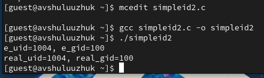

---
## Front matter
lang: ru-RU
title: Лабораторная работа № 6
subtitle: Поиск файлов. Перенаправление ввода-вывода. Просмотр запущенных процессов.
author:
  - Шулуужук Айраана Вячеславовна НПИбд-02-22
institute:
  - Российский университет дружбы народов, Москва, Россия
 
date: 12 матра 2023 

## i18n babel
babel-lang: russian
babel-otherlangs: english

## Formatting pdf
toc: false
toc-title: Содержание
slide_level: 2
aspectratio: 169
section-titles: true
theme: metropolis
header-includes:
 - \metroset{progressbar=frametitle,sectionpage=progressbar,numbering=fraction}
 - '\makeatletter'
 - '\beamer@ignorenonframefalse'
 - '\makeatother'
---

## Докладчик

:::::::::::::: {.columns align=center}
::: {.column width="70%"}

  * Шулуужук Айраана Вячеславовна 
  * НПИбд-02-22
  * 1132221890
  * Российский университет дружбы народов

:::
::: {.column width="30%"}

:::
::::::::::::::
# Цели и задачи

Ознакомление с инструментами поиска файлов и фильтрации текстовых данных. Приобретение практических навыков: по управлению процессами (и заданиями), по проверке использования диска и обслуживанию файловых систем.

# Выполнение лабораторной работы

##

Запишем файл file.txt  названия файлов, содержащихся в каталоге/etc. 

{width=70%}

## 

Выводим имена всех файлов из file.txt, имеющих расширение .conf, после чего запишем их в новый текстовой файл conf.txt.

{width=70%}

##

Определим файлы в домашнем каталоге, начинающие с символа с 

{width=70%}

## 

Выводим на экран имена файлов из каталога /etc, начинающие с символа h

{width=70%}

## 

Запустим в фоновом режиме процесс, который будет записывать в файл ~/logfile файлы, имена которых начинаются с log. Далее удаляем этот файл

{width=70%}

##

Запустим из консоли в фоновом режиме редактор gedit.

{width=70%}

Определим идентификатор процесса gedit, используя команду ps, конвейер и фильтр grep. 

{width=70%}

##

Просмотрим описание команды kill, и после чего используем ее для завершения процесса gedit

{#fig:008 width=70%}

## Комнадa df

Команда df показывает размер каждого смонтированного раздела диска

{width=70%}

## Команда du 

Команда du показывает число килобайт, используемых каждым файлом или каталогом 

{width=70%}

## Команда find 

Воспользовавшись справкой команды find, выводим имена всех директорий, имеющихся домашнем каталоге

{width=50%}

# Выводы

В ходе выполнения работы мы ознакомились с инструментами поиска файлов и фильтрации текстовых данных. Приобрели практические навыки: по управлению процессами (и заданиями), по проверке использования диска и обслуживанию файловых систем

