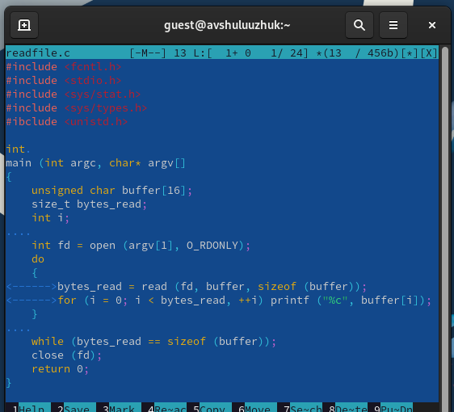

---
## Front matter
title: "Лабораторная работа № 6"
subtitle: "Поиск файлов. Перенаправление ввода-вывода. Просмотр запущенных процессов"
author: "Шулуужук Айраана Вячеславовна НПИбд-02-22"

## Generic otions
lang: ru-RU
toc-title: "Содержание"

## Bibliography
bibliography: bib/cite.bib
csl: pandoc/csl/gost-r-7-0-5-2008-numeric.csl

## Pdf output format
toc: true # Table of contents
toc-depth: 2
lof: true # List of figures
lot: true # List of tables
fontsize: 12pt
linestretch: 1.5
papersize: a4
documentclass: scrreprt
## I18n polyglossia
polyglossia-lang:
  name: russian
  options:
	- spelling=modern
	- babelshorthands=true
polyglossia-otherlangs:
  name: english
## I18n babel
babel-lang: russian
babel-otherlangs: english
## Fonts
mainfont: PT Serif
romanfont: PT Serif
sansfont: PT Sans
monofont: PT Mono
mainfontoptions: Ligatures=TeX
romanfontoptions: Ligatures=TeX
sansfontoptions: Ligatures=TeX,Scale=MatchLowercase
monofontoptions: Scale=MatchLowercase,Scale=0.9
## Biblatex
biblatex: true
biblio-style: "gost-numeric"
biblatexoptions:
  - parentracker=true
  - backend=biber
  - hyperref=auto
  - language=auto
  - autolang=other*
  - citestyle=gost-numeric
## Pandoc-crossref LaTeX customization
figureTitle: "Рис."
tableTitle: "Таблица"
listingTitle: "Листинг"
lofTitle: "Список иллюстраций"
lotTitle: "Список таблиц"
lolTitle: "Листинги"
## Misc options
indent: true
header-includes:
  - \usepackage{indentfirst}
  - \usepackage{float} # keep figures where there are in the text
  - \floatplacement{figure}{H} # keep figures where there are in the text
---

# Цель работы

Ознакомление с инструментами поиска файлов и фильтрации текстовых данных. Приобретение практических навыков: по управлению процессами (и заданиями), по проверке использования диска и обслуживанию файловых систем.

# Задание

1. Осуществите вход в систему, используя соответствующее имя пользователя.

2. Запишите в файл file.txt названия файлов, содержащихся в каталоге /etc. Допишите в этот же файл названия файлов, содержащихся в вашем домашнем каталоге.

3. Выведите имена всех файлов из file.txt, имеющих расширение .conf, после чего запишите их в новый текстовой файл conf.txt.

4. Определите, какие файлы в вашем домашнем каталоге имеют имена, начинавшиеся с символа c? Предложите несколько вариантов, как это сделать.

5. Выведите на экран (по странично) имена файлов из каталога /etc, начинающиеся с символа h

6. Запустите в фоновом режиме процесс, который будет записывать в файл ~/logfile файлы, имена которых начинаются с log.

7. Удалите файл ~/logfile.

8. Запустите из консоли в фоновом режиме редактор gedit

9. Определите идентификатор процесса gedit, используя команду ps, конвейер и фильтр grep. Как ещё можно определить идентификатор процесса?

10. Прочтите справку (man) команды kill, после чего используйте её для завершения процесса gedit.

11. Выполните команды df и du, предварительно получив более подробную информацию об этих командах, с помощью команды man.

12. Воспользовавшись справкой команды find, выведите имена всех директорий, имеющихся в вашем домашнем каталоге.


# Теоретическое введение

## Перенаправление ввода-вывода

В системе по умолчанию открыто три специальных потока:

– stdin — стандартный поток ввода (по умолчанию: клавиатура), файловый дескриптор 0;

– stdout — стандартный поток вывода (по умолчанию: консоль), файловый дескриптор 1;

– stderr — стандартный поток вывод сообщений об ошибках (по умолчанию: консоль), файловый дескриптор 2.

Большинство используемых в консоли команд и программ записывают результаты своей работы в стандартный поток вывода stdout. Например, команда ls выводит в стандартный поток вывода (консоль) список файлов в текущей директории. Потоки вывода и ввода можно перенаправлять на другие файлы или устройства. Проще всего это делается с помощью символов >, >>, <, <<. 

## Конвейер

Конвейер (pipe) служит для объединения простых команд или утилит в цепочки, в которых результат работы предыдущей команды передаётся последующей. Синтаксис следующий:
``` 
команда 1 | команда 2
# означает, что вывод команды 1 передастся на ввод команде 2
```
Конвейеры можно группировать в цепочки и выводить с помощью перенаправления в файл, например:
```
1 ls -la |sort > sortilg_list
```
вывод команды ls -la передаётся команде сортировки sort\verb, которая пишет результат в файл sorting_list\verb. Чаще всего скрипты на Bash используются в качестве автоматизации каких-то рутинных операций в консоли, отсюда иногда возникает необходимость в обработке stdout одной команды и передача на stdin другой команде, при этом результат выполнения команды должен обработан

## Поиск файлов

Команда find используется для поиска и отображения на экран имён файлов, соответствующих заданной строке символов.
Формат команды:
```
find путь [-опции]
```
Путь определяет каталог, начиная с которого по всем подкаталогам будет вестись  поиск

## Фильтрация текста

Найти в текстовом файле указанную строку символов позволяет команда grep. Формат команды:
```
grep строка имя_файла
```
Кроме того, команда grep способна обрабатывать стандартный вывод других команд (любой текст). Для этого следует использовать конвейер, связав вывод команды с вводом grep.

## Проверка использования диска

Команда df показывает размер каждого смонтированного раздела диска.
Формат команды:
```
df [-опции] [файловая_система]
```

Команда du показывает число килобайт, используемое каждым файлом или каталогом.
Формат команды:
```
du [-опции] [имя_файла...]
```

## Управление задачами

Любую выполняющуюся в консоли команду или внешнюю программу можно запустить в фоновом режиме. Для этого следует в конце имени команды указать знак амперсанда &. Например:
```
gedit &
```
Будет запущен текстовой редактор gedit в фоновом режиме. Консоль при этом не будет заблокирована. Запущенные фоном программы называются задачами (jobs). Ими можно управлять с помощью команды jobs, которая выводит список запущенных в данный момент задач. Для завершения задачи необходимо выполнить команду
```
kill %номер задачи 
```

## Управление процессами

Любой команде, выполняемой в системе, присваивается идентификатор процесса (process ID). Получить информацию о процессе и управлять им, пользуясь идентификатором процесса, можно из любого окна командного интерпретатора.

## Получение информации о процессах

Команда ps используется для получения информации о процессах.
Формат команды:
```
ps [-опции]
```
Для получения информации о процессах, управляемых вами и запущенных (работающих или остановленных) на вашем терминале, используйте опцию aux. Пример:
```
ps aux
```
Для запуска команды в фоновом режиме необходимо в конце командной строки указать знак & (амперсанд). Пример работы, требующей много машинного времени для выполнения, и которую целесообразно запустить в фоновом режиме:
```
find /var/log -name "*.log" -print > l.log &
```

# Выполнение лабораторной работы

1. Запишем файл file.txt  названия файлов, содержащихся в каталоге/etc. Допишем в этот же файл названия файлов, содержащихся в домашнем каталоге.(рис. @fig:001)

{#fig:001 width=70%}

2. Выводим имена всех файлов из file.txt, имеющих расширение .conf, после чего запишем их в новый текстовой файл conf.txt. (рис. @fig:002)

{#fig:002 width=70%}

3. Определим файлы в домашнем каталоге, начинающие с символа с (рис. @fig:003)

{#fig:003 width=70%}

4. Выводим на экран имена файлов из каталога /etc, начинающие с символа h (рис. @fig:004)

{#fig:004 width=70%}

5. Запустим в фоновом режиме процесс, который будет записывать в файл ~/logfile файлы, имена которых начинаются с log (рис. @fig:005). Далее удаляем этот файл

{#fig:005 width=70%}

6. Запустим из консоли в фоновом режиме редактор gedit. (рис. @fig:006). 

{#fig:006 width=70%}

7. Определим идентификатор процесса gedit, используя команду ps, конвейер и фильтр grep. (рис. @fig:007)

{#fig:007 width=70%}

8. Просмотрим описание команды kill, и после чего используем ее для завершения процесса gedit (рис. @fig:008)

{#fig:008 width=70%}

9. Выполним команды df и du, предварительно получив более подробную информацию об этих командах, с помощью команды man  (рис. @fig:009) (рис. @fig:010)

Команда df показывает размер каждого смонтированного раздела диска

Команда du показывает число килобайт, используемых каждым файлом или каталогом 

{#fig:009 width=70%}

{#fig:010 width=70%}

10. Воспользовавшись справкой команды find, выводим имена всех директорий, имеющихся домашнем каталоге (рис. @fig:011)

{#fig:011 width=70%}


# Контрольные вопросы

1. Какие потоки ввода вывода вы знаете?

Ввод и вывод распределяется между тремя стандартными потоками: - stdin — стандартный ввод (клавиатура), - stdout — стандартный вывод (экран), - stderr — стандартная ошибка (вывод ошибок на экран).

2. Объясните разницу между операцией > и >>.

Основное отличие: > : Перезаписывает существующий файл или создает файл, если файл с указанным именем отсутствует в каталоге. » : добавляет существующий файл или создает файл, если файл с указанным именем отсутствует в каталоге.

3. Что такое конвейер?

Конвейер (англ. pipeline) в терминологии операционных систем семейства Unix — некоторое множество процессов, для которых выполнено следующее перенаправление ввода-вывода: то, что выводит на поток стандартного вывода предыдущий процесс, попадает в поток стандартного ввода следующего процесса.

4. Что такое процесс? Чем это понятие отличается от программы?

Процесс - это программа на стадии выполнения - “объект”, которому выделено
процессорное время - асинхронная работа

5. Что такое PID и GID?

Идентификатор процесса (PID). Каждому новому процессу ядро присваивает уникальный идентификационный номер. В любой момент времени идентификатор процесса является уникальным, хотя после завершения процесса он может использоваться снова для другого процесса. Некоторые идентификаторы зарезервированы системой для особых процессов. Так, процесс с идентификатором 1 - это процесс инициализации init, являющийся предком всех других процессов в системе. Идентификатор группы GID и эффективный идентификатор группы (EGID) GID - это идентификационный номер группы данного процесса. EGID связан с GID также, как EUID с UID.

6. Что такое задачи и какая команда позволяет ими управлять?

Принудительное завершение процесса и изменение его приоритета) можно выполнить и без команды top. Процессы в Linux имеют возможность обмениваться так называемыми “сигналами” с ядром и другими процессами. При получении сигнала процессом, управление передается подпрограмме его обработки или ядру, если такой подпрограммы не существует. В Linux имеется команда kill, которая позволяет послать заданному процессу любой сигнал.

7. Найдите информацию об утилитах top и htop. Каковы их функции?

top - интерактивный просмотрщик процессов. htop аналог top. Программа top динамически выводит в режиме реального времени информации о работающей системе, т.е. о фактической активности процессов. По умолчанию она выдает задачи, наиболее загружающие процессор сервера, и обновляет список каждые две секунды.

8. Назовите и дайте характеристику команде поиска файлов. Приведите примеры использования этой команды.

find : Для поиска файлов из командной строки вы можете использовать команду “find”. У этой команды следующий синтаксис: find path criteria action - “path” - Секция для указания директории поиска. Если ничего не указано поиск идет по текущей директории. - “criteria” - Опции поиска. - “action” -Опции, которые влияют на состояние поиска или контролируют его, например, - “–print”

9. Можно ли по контексту (содержанию) найти файл? Если да, то как?

Для поиска файла по содержимому проще всего воспользоваться командой grep (вместо find).
Пример: grep -r строка_поиска каталог

10. Как определить объем свободной памяти на жёстком диске?

Самый простой способ найти свободное место на диске в Linux - это используйте  команду df. Команда df означает «свободное от диска» и, очевидно, показывает вам свободное и доступное дисковое пространство в системах Linux. Работы С Нами -h вариант, он показывает дисковое пространство в удобочитаемом формате (МБ и ГБ).

11. Как определить объем вашего домашнего каталога?

В операционных системах на базе Linux посмотреть размер папки (директории) можно с помощью команды du. Эта команда, выполняемая в консоли, позволяет оценить используемый объем места на жестком диске отдельно по папкам и файлам, просуммировать результат, узнать общий размер папки.

12. Как удалить зависший процесс?

Убиваем процессы в Linux — команды ps, kill и killall

• Находим PID зависшего процесса Каждый процесс в Linux имеет свой идентификатор, называемый PID.

• «Убиваем» процесс командой kill. Когда известен PID процесса, мы можем убить его командой kill.

• Убиваем процессы командой killall.

• Заключение

# Выводы

В ходе выполнения работы мы ознакомились с инструментами поиска файлов и фильтрации текстовых данных. Приобрели практические навыки: по управлению процессами (и заданиями), по проверке использования диска и обслуживанию файловых систем
 

