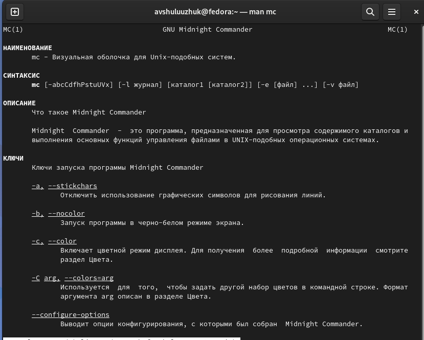
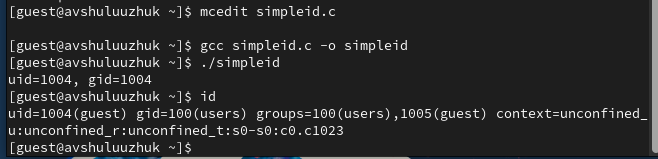
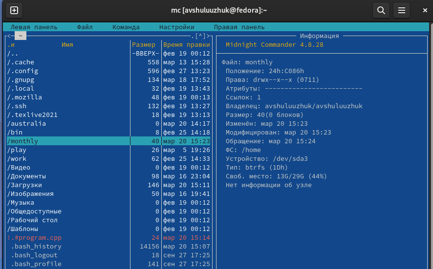
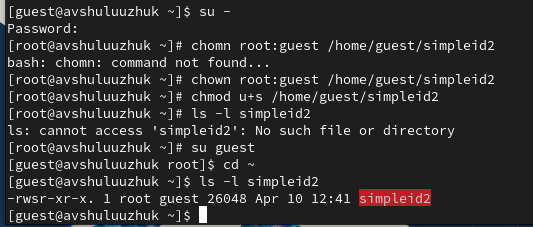
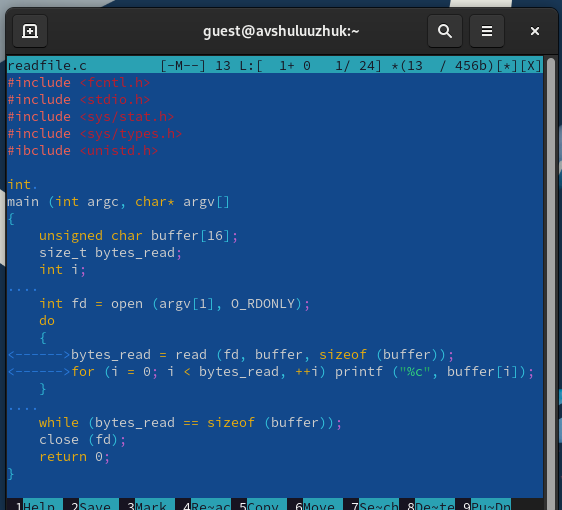
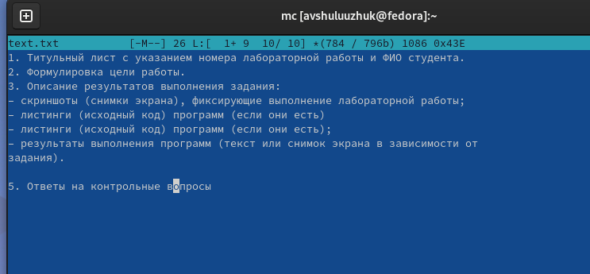
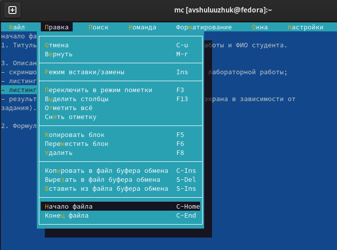
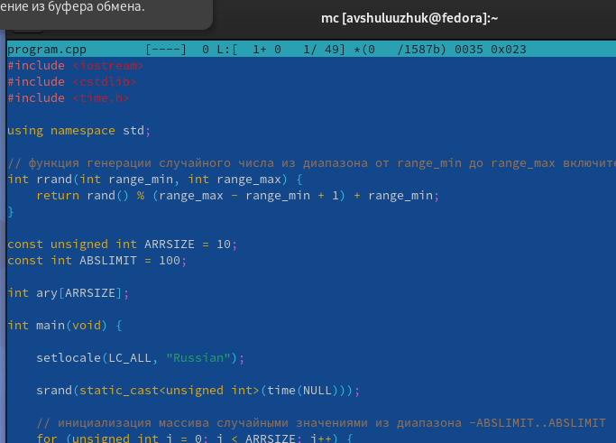

---
## Front matter
lang: ru-RU
title: Лабораторная работа № 7
subtitle: Командная оболочка Midnight Commander
author:
  - Шулуужук Айраана Вячеславовна НПИбд-02-22
institute:
  - Российский университет дружбы народов, Москва, Россия
 
date: 20 матра 2023 

## i18n babel
babel-lang: russian
babel-otherlangs: english

## Formatting pdf
toc: false
toc-title: Содержание
slide_level: 2
aspectratio: 169
section-titles: true
theme: metropolis
header-includes:
 - \metroset{progressbar=frametitle,sectionpage=progressbar,numbering=fraction}
 - '\makeatletter'
 - '\beamer@ignorenonframefalse'
 - '\makeatother'
---

## Докладчик

:::::::::::::: {.columns align=center}
::: {.column width="70%"}

  * Шулуужук Айраана Вячеславовна 
  * НПИбд-02-22
  * 1132221890
  * Российский университет дружбы народов

:::
::: {.column width="30%"}

:::
::::::::::::::
# Цели и задачи

Освоение основных возможностей командной оболочки Midnight Commander. Приобретение навыков практической работы по просмотру каталогов и файлов; манипуляций с ними

# Выполнение лабораторной работы

##

Изучим информацию о mc 

{width=50%}

## 

Выполним несколько операций в mc, используя управляющие клавиши

{width=70%}

##

Оценим степень подробности вывода информации о файлах 

{width=70%}

## Возможности подменю Файл

просмотр содержимого текстового файла и редактирование

{width=60%}

## Возможности подменю Файл

создание нового каталога

{width=60%}

## Возможности подменю Файл

копирование файлов в созданный каталог newd 

{width=50%}

## Подменю Команда

поиск в файловой системе файла с заданными условиями (например, файла с расширением .c или .cpp, содержащего строку main)

{width=50%}

## Подменю Команда

переход в домашний каталог 

{width=60%}

## 

Создадим текстовый файл text.txt, откроем его с помощью редактора в mc и вставим любой текст из интернета

{width=70%}

## 

Проделаем с текстом манипуляции, используя горячие клавиши

-для удаления строки текста используем клавиши "Сtrl+y"

-выделим фграмент текста F3 и скопируем его на новую строку F5 

-выделим фграмент текста F3 и перенесем его на новую строку F6 

##

-перейдем в конец и начало файла и напишем любой текст 

{width=60%}

## 

Откроем файл с исходным текстом на языке программирования и включим подсветку синтаксиса.

{width=60%}

# Выводы

В ходе выполнения работы мы освоили основные возможности командной оболочки Midnight Commander. Приобрели  навыки практической работы по просмотру каталогов и файлов, а также манипуляций с ними.

