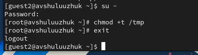

---
## Front matter
title: "Лабораторная работа № 7"
subtitle: "Командная оболочка Midnight Commander"
author: "Шулуужук Айраана Вячеславовна НПИбд-02-22"

## Generic otions
lang: ru-RU
toc-title: "Содержание"

## Bibliography
bibliography: bib/cite.bib
csl: pandoc/csl/gost-r-7-0-5-2008-numeric.csl

## Pdf output format
toc: true # Table of contents
toc-depth: 2
lof: true # List of figures
lot: true # List of tables
fontsize: 12pt
linestretch: 1.5
papersize: a4
documentclass: scrreprt
## I18n polyglossia
polyglossia-lang:
  name: russian
  options:
	- spelling=modern
	- babelshorthands=true
polyglossia-otherlangs:
  name: english
## I18n babel
babel-lang: russian
babel-otherlangs: english
## Fonts
mainfont: PT Serif
romanfont: PT Serif
sansfont: PT Sans
monofont: PT Mono
mainfontoptions: Ligatures=TeX
romanfontoptions: Ligatures=TeX
sansfontoptions: Ligatures=TeX,Scale=MatchLowercase
monofontoptions: Scale=MatchLowercase,Scale=0.9
## Biblatex
biblatex: true
biblio-style: "gost-numeric"
biblatexoptions:
  - parentracker=true
  - backend=biber
  - hyperref=auto
  - language=auto
  - autolang=other*
  - citestyle=gost-numeric
## Pandoc-crossref LaTeX customization
figureTitle: "Рис."
tableTitle: "Таблица"
listingTitle: "Листинг"
lofTitle: "Список иллюстраций"
lotTitle: "Список таблиц"
lolTitle: "Листинги"
## Misc options
indent: true
header-includes:
  - \usepackage{indentfirst}
  - \usepackage{float} # keep figures where there are in the text
  - \floatplacement{figure}{H} # keep figures where there are in the text
---

# Цель работы

Освоение основных возможностей командной оболочки Midnight Commander. Приобретение навыков практической работы по просмотру каталогов и файлов; манипуляций с ними.

# Задание по mc 

1. Изучите информацию о mc, вызвав в командной строке man mc.

2. Запустите из командной строки mc, изучите его структуру и меню.

3. Выполните несколько операций в mc, используя управляющие клавиши (операции с панелями; выделение/отмена выделения файлов, копирование/перемещение файлов, получение информации о размере и правах доступа на файлы и/или каталоги и т.п.)

4. Выполните основные команды меню левой (или правой) панели. Оцените степень подробности вывода информации о файлах.

5. Используя возможности подменю Файл , выполните:

– просмотр содержимого текстового файла;

– редактирование содержимого текстового файла (без сохранения результатов редактирования);

– создание каталога;

– копирование в файлов в созданный каталог

6. С помощью соответствующих средств подменю Команда осуществите:

– поиск в файловой системе файла с заданными условиями (например, файла с расширением .c или .cpp, содержащего строку main);

– выбор и повторение одной из предыдущих команд;

– переход в домашний каталог;

– анализ файла меню и файла расширений.

7. Вызовите подменю Настройки . Освойте операции, определяющие структуру экрана mc (Full screen, Double Width, Show Hidden Files и т.д.)

# Задание по встроенному редактору mc

1. Создайте текстовой файл text.txt.

2. Откройте этот файл с помощью встроенного в mc редактора.

3. Вставьте в открытый файл небольшой фрагмент текста, скопированный из любого другого файла или Интернета.

4. Проделайте с текстом следующие манипуляции, используя горячие клавиши:

4.1. Удалите строку текста.

4.2. Выделите фрагмент текста и скопируйте его на новую строку.

4.3. Выделите фрагмент текста и перенесите его на новую строку.

4.4. Сохраните файл.

4.5. Отмените последнее действие.

4.6. Перейдите в конец файла (нажав комбинацию клавиш) и напишите некоторый текст.

4.7. Перейдите в начало файла (нажав комбинацию клавиш) и напишите некоторый текст.

4.8. Сохраните и закройте файл.

5. Откройте файл с исходным текстом на некотором языке программирования (например C или Java)

6. Используя меню редактора, включите подсветку синтаксиса, если она не включена, или выключите, если она включена.

# Теоретическое введение

## Общие сведения 

Командная оболочка — интерфейс взаимодействия пользователя с операционной системой и программным обеспечением посредством команд. Midnight Commander (или mc) — псевдографическая командная оболочка для UNIX/Linux систем. Для запуска mc необходимо в командной строке набрать mc и нажать Enter. Рабочее пространство mc имеет две панели, отображающие по умолчанию списки файлов двух каталогов.

Над панелями располагается меню, доступ к которому осуществляется с помощью клавиши F9 . Под панелями внизу расположены управляющие экранные кнопки, ассоциированные с функциональными клавишами F1 – F10 (табл. 7.1). Над ними располагается командная строка, предназначенная для ввода команд.

Функциональные клавиши mc

F1 Вызов контекстно-зависимой подсказки

F2 Вызов пользовательского меню с возможностью создания и/или дополнения дополнительных функций

F3 Просмотр содержимого файла, на который указывает подсветка в активной панели (без возможности редактирования)

F4 Вызов встроенного в mc редактора для изменения содержания файла, на который указывает подсветка в активной панели

F5 Копирование одного или нескольких файлов, отмеченных в первой (активной) панели, в каталог, отображаемый на второй панели

F6 Перенос одного или нескольких файлов, отмеченных в первой (активной) панели, в каталог, отображаемый на второй панели

F7 Создание подкаталога в каталоге, отображаемом в активной панели

F8 Удаление одного или нескольких файлов (каталогов), отмеченных в первой (активной) панели файлов

F9 Вызов меню mc

F10 Выход из mc

## Режимы отображения панелей и управление ими

Панель в mc отображает список файлов текущего каталога. Абсолютный путь к этому каталогу отображается в заголовке панели. У активной панели заголовок и одна из её строк подсвечиваются. Управление панелями осуществляется с помощью определённых комбинаций клавиш или пунктов меню mc. Панели можно поменять местами. Для этого и используется комбинация клавиш Ctrl-u или команда меню mc Переставить панели . Также можно временно убрать отображение панелей (отключить их) с помощью комбинации клавиш Ctrl-o или команды меню mc Отключить панели . Это может быть полезно, например, если необходимо увидеть вывод какой-то информации на экран после выполнения какой-либо команды shell. С помощью последовательного применения комбинации клавиш Ctrl-x d есть возможность сравнения каталогов, отображённых на двух панелях. Панели могут дополнительно быть переведены в один из двух режимов: Информация или Дерево . В режиме Информация на панель выводятся сведения о файле и текущей файловой системе, расположенных на активной панели. В режиме Дерево на одной из панелей выводится структура дерева каталогов. Управлять режимами отображения панелей можно через пункты меню mc Правая панель и Левая панель.

## Меню панелей

Перейти в строку меню панелей mc можно с помощью функциональной клавиши F9 . В строке меню имеются пять меню: Левая панель , Файл , Команда , Настройки и Правая панель .

Подпункт меню Быстрый просмотр позволяет выполнить быстрый просмотр содержимого панели.

Подпункт меню Информация позволяет посмотреть информацию о файле или каталоге

В меню каждой (левой или правой) панели можно выбрать Формат списка :

– стандартный — выводит список файлов и каталогов с указанием размера и времени правки;

– ускоренный — позволяет задать число столбцов, на которые разбивается панель при выводе списка имён файлов или каталогов без дополнительной информации;

– расширенный — помимо названия файла или каталога выводит сведения о правах доступа, владельце, группе, размере, времени правки;

– определённый пользователем — позволяет вывести те сведения о файле или каталоге, которые задаст сам пользователь.

Подпункт меню Порядок сортировки позволяет задать критерии сортировки при выводе списка файлов и каталогов: без сортировки, по имени, расширенный, время правки, время доступа, время изменения атрибута, размер, узел

## Меню Файл

Команды меню Файл :

– Просмотр ( F3 ) — позволяет посмотреть содержимое текущего (или выделенного) файла без возможности редактирования.

– Просмотр вывода команды ( М + ! ) — функция запроса команды с параметрами (аргумент к текущему выбранному файлу).

– Правка ( F4 ) — открывает текущий (или выделенный) файл для его редактирования.

– Копирование ( F5 ) — осуществляет копирование одного или нескольких файлов или каталогов в указанное пользователем во всплывающем окне место.

– Права доступа ( Ctrl-x c ) — позволяет указать (изменить) права доступа к одному или нескольким файлам или каталогам

– Жёсткая ссылка ( Ctrl-x l ) — позволяет создать жёсткую ссылку к текущему (или выделенному) файлу1.

– Символическая ссылка ( Ctrl-x s ) — позволяет создать символическую ссылку к текущему (или выделенному) файлу2.

– Владелец/группа ( Ctrl-x o ) — позволяет задать (изменить) владельца и имя группы для одного или нескольких файлов или каталогов.

– Права (расширенные) — позволяет изменить права доступа и владения для одного или нескольких файлов или каталогов.

– Переименование ( F6 ) — позволяет переименовать (или переместить) один или несколько файлов или каталогов.

– Создание каталога ( F7 ) — позволяет создать каталог.

– Удалить ( F8 ) — позволяет удалить один или несколько файлов или каталогов.

– Выход ( F10 ) — завершает работу mc.

# Выполнение лабораторной работы

1. Изучим информацию о mc (рис. @fig:001)

{#fig:001 width=70%}

2. Выполним несколько операций в mc, используя управляющие клавиши (операции с панелями; выделение/отмена выделения файлов, копирование/перемещение файлов, получение информации о размере и правах доступа на файлы и/или каталоги (рис. @fig:002)

{#fig:002 width=70%}

3. Выполним основные команды меню левой (или правой) панели. Оценим степень подробности вывода информации о файлах (рис. @fig:003)

{#fig:003 width=70%}

4. Используя возможности подменю Файл , выполним:

– просмотр содержимого текстового файла и редактирование (рис. @fig:004)

{#fig:004 width=70%}

– создание нового каталога  (рис. @fig:005)

{#fig:005 width=70%}

– копирование файлов в созданный каталог newd (рис. @fig:006)

{#fig:006 width=70%}

5. С помощью соответствующих средств подменю Команда осуществим:

– поиск в файловой системе файла с заданными условиями (например, файла с расширением .c или .cpp, содержащего строку main) (рис. @fig:007)

{#fig:007 width=70%}

– выбор и повторение одной из предыдущих команд (рис. @fig:008)

{#fig:008 width=70%}

– переход в домашний каталог  (рис. @fig:009)

{#fig:009 width=70%}

– анализ файла меню и файла расширений (рис. @fig:010) (рис. @fig:011)

{#fig:010 width=70%}

{#fig:011 width=70%}

6. Создадим текстовый файл text.txt, откроем его с помощью редактора в mc и вставим любой текст из интернета (рис. @fig:012)

{#fig:012 width=70%}

7. Проделаем с текстом манипуляции, используя горячие клавиши

-для удаления строки текста используем клавиши "Сtrl+y"

-выделим фграмент текста F3 и скопируем его на новую строку F5 

-выделим фграмент текста F3 и перенесем его на новую строку F6 

-перейдем в конец и начало файла и напишем любой текст (рис. @fig:013)

{#fig:013 width=70%}
 
8. Откроем файл с исходным текстом на языке программирования и включим подсветку синтаксиса (рис. @fig:014)

{#fig:014 width=70%}

# Выводы

В ходе выполнения работы мы освоили основные возможности командной оболочки Midnight Commander. Приобрели  навыки практической работы по просмотру каталогов и файлов, а также манипуляций с ними.

