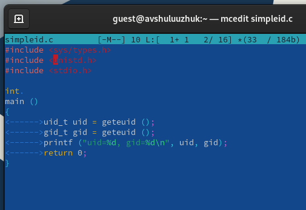

---
## Front matter
lang: ru-RU
title: Лабораторная работа № 8
subtitle: Текстовой редактор vi
author:
  - Шулуужук Айраана Вячеславовна НПИбд-02-22
institute:
  - Российский университет дружбы народов, Москва, Россия
 
date: 27 матра 2023 

## i18n babel
babel-lang: russian
babel-otherlangs: english

## Formatting pdf
toc: false
toc-title: Содержание
slide_level: 2
aspectratio: 169
section-titles: true
theme: metropolis
header-includes:
 - \metroset{progressbar=frametitle,sectionpage=progressbar,numbering=fraction}
 - '\makeatletter'
 - '\beamer@ignorenonframefalse'
 - '\makeatother'
---

## Докладчик

:::::::::::::: {.columns align=center}
::: {.column width="70%"}

  * Шулуужук Айраана Вячеславовна 
  * НПИбд-02-22
  * 1132221890
  * Российский университет дружбы народов

:::
::: {.column width="30%"}

:::
::::::::::::::
# Цели и задачи

Познакомиться с операционной системой Linux. Получить практические навыки работы с редактором vi, установленным по умолчанию практически во всех дистрибутивах

# Выполнение лабораторной работы

##

Создаем каталог с именем work/os/lab06 и проведем вызов vi

{width=70%}

## 

Введем текст в файл и завершим ввод текста

{width=70%}

##

Перейдем в режим последней строки, запишем файл w и выйдем q для сохранения текста 

{width=70%}

##

Сделаем данный файл исполняемым 

{width=70%}

## 

Вызовыим файл на редактирование и установим курсор в конец слова HELL. Перейдем в режим вставки и заменим его на HELLO. 

{width=70%}

## 

Установим курсор на последнюю строку и вставим текст echo $HELLO 

{width=70%}

## 

Удалим последнюю строку, используя двойное нвжатие d, и введем комнаду отмены изменений u 

{width=70%}

##

Переходим в режим последней строки, запишем произведенные изменения и сохраним файл

{width=70%}

# Выводы

В ходе выполнения работы мы познакомились с операционной системой Linux. Получили практические навыки работы с редактором vi, установленным по умолчанию практически во всех дистрибутивах

