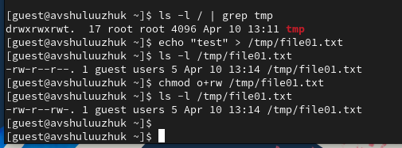

---
## Front matter
title: "Лабораторная работа № 81"
subtitle: "Текстовой редактор vi"
author: "Шулуужук Айраана Вячеславовна НПИбд-02-22"

## Generic otions
lang: ru-RU
toc-title: "Содержание"

## Bibliography
bibliography: bib/cite.bib
csl: pandoc/csl/gost-r-7-0-5-2008-numeric.csl

## Pdf output format
toc: true # Table of contents
toc-depth: 2
lof: true # List of figures
lot: true # List of tables
fontsize: 12pt
linestretch: 1.5
papersize: a4
documentclass: scrreprt
## I18n polyglossia
polyglossia-lang:
  name: russian
  options:
	- spelling=modern
	- babelshorthands=true
polyglossia-otherlangs:
  name: english
## I18n babel
babel-lang: russian
babel-otherlangs: english
## Fonts
mainfont: PT Serif
romanfont: PT Serif
sansfont: PT Sans
monofont: PT Mono
mainfontoptions: Ligatures=TeX
romanfontoptions: Ligatures=TeX
sansfontoptions: Ligatures=TeX,Scale=MatchLowercase
monofontoptions: Scale=MatchLowercase,Scale=0.9
## Biblatex
biblatex: true
biblio-style: "gost-numeric"
biblatexoptions:
  - parentracker=true
  - backend=biber
  - hyperref=auto
  - language=auto
  - autolang=other*
  - citestyle=gost-numeric
## Pandoc-crossref LaTeX customization
figureTitle: "Рис."
tableTitle: "Таблица"
listingTitle: "Листинг"
lofTitle: "Список иллюстраций"
lotTitle: "Список таблиц"
lolTitle: "Листинги"
## Misc options
indent: true
header-includes:
  - \usepackage{indentfirst}
  - \usepackage{float} # keep figures where there are in the text
  - \floatplacement{figure}{H} # keep figures where there are in the text
---

# Цель работы

Познакомиться с операционной системой Linux. Получить практические навыки работы с редактором vi, установленным по умолчанию практически во всех дистрибутивах

# Задание

1. Ознакомиться с теоретическим материалом.

2. Ознакомиться с редактором vi.

3. Выполнить упражнения, используя команды vi.

# Теоретическое введение

В большинстве дистрибутивов Linux в качестве текстового редактора по умолчанию устанавливается интерактивный экранный редактор vi (Visual display editor). Редактор vi имеет три режима работы:

– командный режим — предназначен для ввода команд редактирования и навигации по редактируемому файлу;

– режим вставки — предназначен для ввода содержания редактируемого файла;

– режим последней (или командной) строки — используется для записи изменений в файл и выхода из редактора.

Для вызова редактора vi необходимо указать команду vi и имя редактируемого файла: vi <имя_файла>. При этом в случае отсутствия файла с указанным именем будет создан такой файл. Переход в командный режим осуществляется нажатием клавиши Esc . Для выхода из редактора vi необходимо перейти в режим последней строки: находясь в командном режиме, нажать Shift-; (по сути символ : — двоеточие), затем:

– набрать символы wq, если перед выходом из редактора требуется записать изменения в файл;

– набрать символ q (или q!), если требуется выйти из редактора без сохранения.

Замечание. Следует помнить, что vi различает прописные и строчные буквы при наборе (восприятии) команд

# Выполнение лабораторной работы

1. Создаем каталог с именем work/os/lab06 и проведем вызов vi(рис. @fig:001)

{#fig:001 width=70%}

2. Введем текст в файл и завершим ввод текста (рис. @fig:002)

{#fig:002 width=70%}

3. Перейдем в режим последней строки, запишем файл w и выйдем q для сохранения текста  (рис. @fig:003)

{#fig:003 width=70%}

4. Сделаем данный файл исполняемым (рис. @fig:004)

{#fig:004 width=70%}

5. Вызовыим файл на редактирование и установим курсор в конец слова HELL. Перейдем в режим вставки и заменим его на HELLO. (рис. @fig:005)

{#fig:005 width=70%}

6. Установим курсор на четвертую строку и удерем слово LOCAL. Переходим в режим вставки и введем local (рис. @fig:006)

{#fig:006 width=70%}

7. Установим курсор на последнюю строку и вставим текст echo $HELLO (рис. @fig:007)

{#fig:007 width=70%}

8. Удалим последнюю строку, используя двойное нвжатие d, и введем комнаду отмены изменений u (рис. @fig:008) (рис. @fig:009)

{#fig:008 width=70%}

{#fig:009 width=70%}

9. Переходим в режим последней строки, запишем произведенные изменения и сохраним файл (рис. @fig:010)

{#fig:010 width=70%}

# Выводы

В ходе выполнения работы мы познакомились с операционной системой Linux. Получили практические навыки работы с редактором vi, установленным по умолчанию практически во всех дистрибутивах
