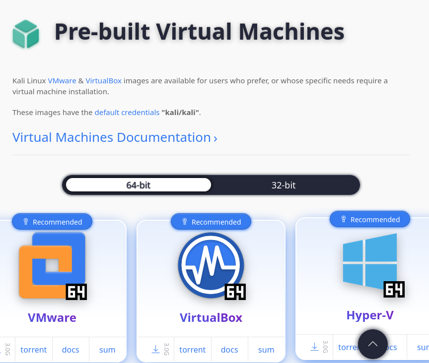
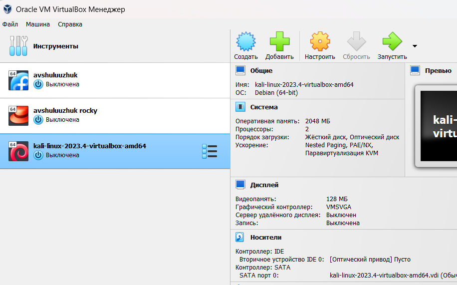
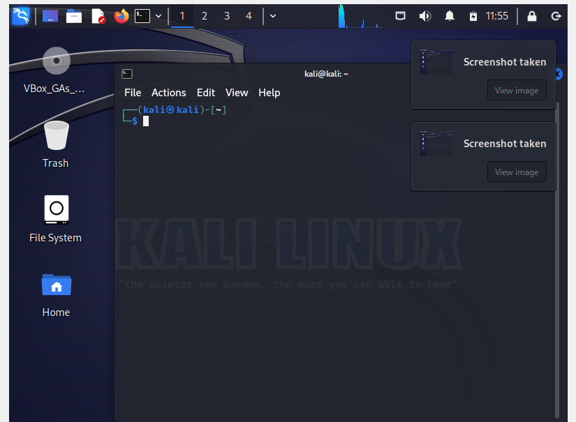

---
## Front matter
lang: ru-RU
title: Индивидуальный проект. 1 этап
subtitle: "Установка Kali Linux"
author:
  - Шулуужук Айраана Вячеславовна, НПИбд-02-22
institute:
  - Российский университет дружбы народов, Москва, Россия
 
date: 26 февраля 2024

## i18n babel
babel-lang: russian
babel-otherlangs: english

## Formatting pdf
toc: false
toc-title: Содержание
slide_level: 2
aspectratio: 169
section-titles: true
theme: metropolis
header-includes:
 - \metroset{progressbar=frametitle,sectionpage=progressbar,numbering=fraction}
 - '\makeatletter'
 - '\beamer@ignorenonframefalse'
 - '\makeatother'
---

## Докладчик

:::::::::::::: {.columns align=center}
::: {.column width="70%"}

  * Шулуужук Айраана Вячеславовна 
  * НПИбд-02-22
  * 1132221890
  * Российский университет дружбы народов

:::
::: {.column width="30%"}

:::
::::::::::::::

# Цели и задачи

Установка дистрибутива Kali Linux в виртуальную машину.

# Выполнение индивидуального проекта

## Выполнение индивидуального проекта

Скачиваем архив с образом диска для виртуальной машины

{#fig:001 width=50%}

## Выполнение индивидуального проекта

После загрузки диска с образом создаем виртуальную машину и устанавливаем первоначальные настройки

{#fig:002 width=50%}

## Выполнение индивидуального проекта

После создания виртуальной машины запускаем ее

{#fig:003 width=50%}

# Выводы

В ходе выполнения первого этапа индивидуального проекта мы установили дистрибутив Kali Linux на виртуальную машинe для дальнейшей работы

