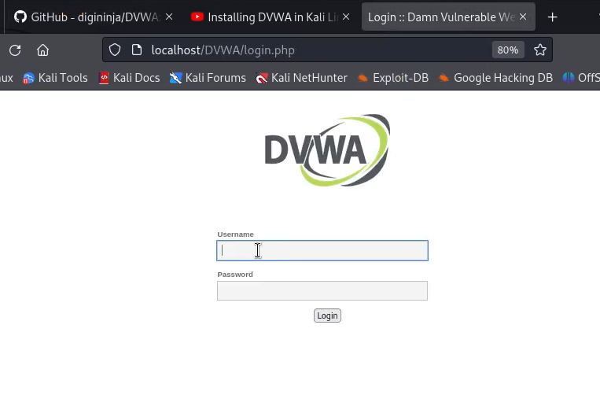
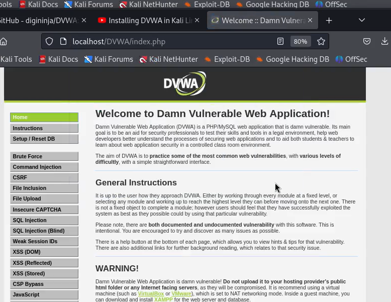

---
## Front matter
lang: ru-RU
title: Индивидуальный проект. 3 этап
subtitle: Операционные системы 
author:
  - Шулуужук Айраана Вячеславовна, НПИбд-02-22
institute:
  - Российский университет дружбы народов, Москва, Россия
 
date: 2 апреля 2023

## i18n babel
babel-lang: russian
babel-otherlangs: english

## Formatting pdf
toc: false
toc-title: Содержание
slide_level: 2
aspectratio: 169
section-titles: true
theme: metropolis
header-includes:
 - \metroset{progressbar=frametitle,sectionpage=progressbar,numbering=fraction}
 - '\makeatletter'
 - '\beamer@ignorenonframefalse'
 - '\makeatother'
---

## Докладчик

:::::::::::::: {.columns align=center}
::: {.column width="70%"}

  * Шулуужук Айраана Вячеславовна 
  * НПИбд-02-22
  * 1132221890
  * Российский университет дружбы народов

:::
::: {.column width="30%"}

:::
::::::::::::::

# Цели и задачи

Добавить к сайту достижения.

# Выполнение индивидуального проекта

## Добавление навыков

В каталоге content в файле index.md добавим информацию о навыках 

{width=70%}

## 

{width=70%}

## Добавление опыта

Добавим информацию об опыте 

{width=70%}

## 

{width=70%}

## Добавление достижений

Добавим информацию о достижениях 

{width=70%}

## 

{width=70%}

## Создание поста по прошедшей неделе

Сделаем пост по прошедшей неделе 

{width=70%}

## Создание поста по теме "Языки разметки. LaTex"

Сделаем пост по теме "Языки разметки. LaTex"

{width=70%}

## Созданные посты

Созданные посты 

{width=70%}

# Выводы

В ходе выполнения 3 этапа индивидуального проекта мы добавили информацию о навыках, об опыте и достижениях вдалельца сайта. Также сделали пост по прошедшей неделе и пост по теме "Языки разметки"

