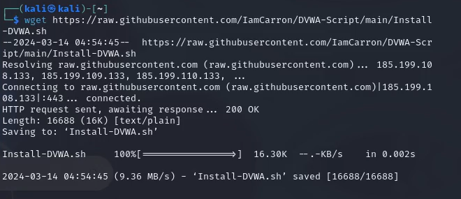
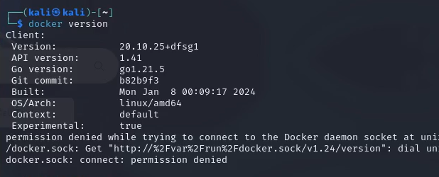

---
## Front matter
lang: ru-RU
title: Индивидуальный проект. 5 этап
subtitle: Операционные системы 
author:
  - Шулуужук Айраана Вячеславовна, НПИбд-02-22
institute:
  - Российский университет дружбы народов, Москва, Россия
 
date: 24 апреля 2023

## i18n babel
babel-lang: russian
babel-otherlangs: english

## Formatting pdf
toc: false
toc-title: Содержание
slide_level: 2
aspectratio: 169
section-titles: true
theme: metropolis
header-includes:
 - \metroset{progressbar=frametitle,sectionpage=progressbar,numbering=fraction}
 - '\makeatletter'
 - '\beamer@ignorenonframefalse'
 - '\makeatother'
---

## Докладчик

:::::::::::::: {.columns align=center}
::: {.column width="70%"}

  * Шулуужук Айраана Вячеславовна 
  * НПИбд-02-22
  * 1132221890
  * Российский университет дружбы народов

:::
::: {.column width="30%"}

:::
::::::::::::::

# Цели и задачи

Добавить с сайту все остальные элементы: записи для персональных проектов

# Выполнение индивидуального проекта

## Выполнение индивидуального проекта

Добавим запись для персональных проектов. Прикрепляем ссылку на гитхаб 

{width=60%}

## Выполнение индивидуального проекта

{width=70%}

## Выполнение индивидуального проекта

Добавим пост по прошедшей неделе

{width=40%}

## Выполнение индивидуального проекта

{width=70%}

## Выполнение индивидуального проекта

Создадим пост по теме "Языки научного программирования" 

{width=40%}

## Выполнение индивидуального проекта

{width=70%}

# Выводы

В ходе выполнения 5 этапа индивидуального проекта мы добавили записи для персональных проектов вдалельца сайта. Также сделали пост по прошедшей неделе и пост по теме "Языки научного программирования" 

